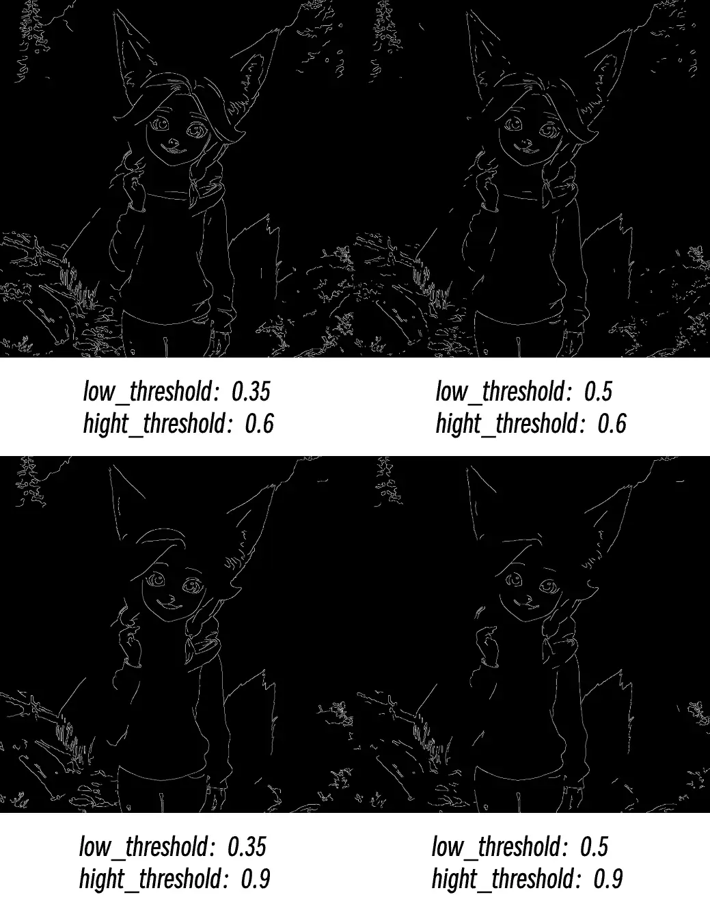

# Canny

Fotoğraflardaki tüm kenar çizgilerini ayıklayın, tıpkı bir fotoğrafın üzerinden kalemle geçerek nesnelerin konturlarını ve detay sınırlarını çıkarmak gibi.

## Çalışma Prensibi

Bir fotoğrafın üzerinden kalemle geçmesi gereken bir sanatçı olduğunuzu hayal edin. Canny düğümü, nereye çizgi (kenar) çizileceğine ve nereye çizilmeyeceğine karar vermenize yardımcı olan akıllı bir asistan gibi çalışır.

Bu süreç bir eleme işi gibidir:

- **Yüksek eşik**, "çizgi çizilmesi gereken standart"tır: yalnızca çok belirgin ve net kontur çizgileri çizilir; örneğin insan yüz hatları ve bina çerçeveleri gibi.
- **Düşük eşik**, "kesinlikle çizgi çizilmemesi gereken standart"tır: çok zayıf kenarlar, gürültü ve anlamsız çizgiler çizmekten kaçınmak için yok sayılır.
- **Orta alan**: İki standart arasındaki kenarlar, eğer "çizilmesi gereken çizgilere" bağlanıyorsa birlikte çizilir, ancak izole ise çizilmez.

Nihai çıktı, beyaz kısımların algılanan kenar çizgileri ve siyah kısımların kenar olmayan alanlar olduğu siyah beyaz bir görüntüdür.

## Girişler

| Parametre Adı | İşlev Açıklaması | Veri Türü | Giriş Türü | Varsayılan | Aralık |
| --- | --- | --- | --- | --- | --- |
| `görüntü` | Kenar çıkarma işlemi yapılacak orijinal fotoğraf | IMAGE | Giriş | - | - |
| `düşük_eşik` | Düşük eşik, ne kadar zayıf kenarların yok sayılacağını belirler. Daha düşük değerler daha fazla detay korur ancak gürültü oluşturabilir | FLOAT | Widget | 0.4 | 0.01-0.99 |
| `yüksek_eşik` | Yüksek eşik, ne kadar güçlü kenarların korunacağını belirler. Daha yüksek değerler yalnızca en belirgin kontur çizgilerini tutar | FLOAT | Widget | 0.8 | 0.01-0.99 |

## Çıktılar

| Çıktı Adı | Açıklama | Veri Türü |
| --- | --- | --- |
| `görüntü` | Siyah beyaz kenar görüntüsü; beyaz çizgiler algılanan kenarlar, siyah alanlar kenar olmayan kısımlardır | IMAGE |

## Parametre Karşılaştırması

**Sık Karşılaşılan Sorunlar:**

- Kırık kenarlar: Yüksek eşiği düşürmeyi deneyin
- Çok fazla gürültü: Düşük eşiği yükseltin
- Önemli detayların eksik olması: Düşük eşiği düşürün
- Kenarların çok pürüzlü olması: Giriş görüntüsünün kalitesini ve çözünürlüğünü kontrol edin

> Bu belge yapay zeka tarafından oluşturulmuştur. Herhangi bir hata bulursanız veya iyileştirme önerileriniz varsa, katkıda bulunmaktan çekinmeyin! [GitHub'da Düzenle](https://github.com/Comfy-Org/embedded-docs/blob/main/comfyui_embedded_docs/docs/Canny/tr.md)
