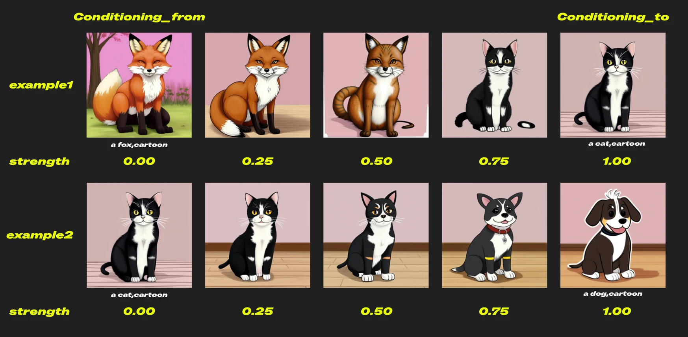

# 條件設定（平均）

`ConditioningAverage` 節點用於根據指定的權重混合兩組不同的條件（例如文字提示），生成介於兩者之間的新條件向量。透過調整權重參數，您可以靈活控制每個條件對最終結果的影響。此功能特別適用於提示詞插值、風格融合等高階應用場景。

如下圖所示，透過調整 `conditioning_to` 的強度，您可以輸出介於兩個條件之間的結果。

## 輸入

| 參數 | 說明 | Comfy 資料類型 |
| --- | --- | --- |
| `conditioning_to` | 目標條件向量，作為加權平均的主要基礎。 | `CONDITIONING` |
| `conditioning_from` | 來源條件向量，將根據特定權重混合到目標中。 | `CONDITIONING` |
| `conditioning_to_strength` | 目標條件的強度，範圍 0.0-1.0，預設值 1.0，步進 0.01。 | `FLOAT` |

## 輸出

| 參數 | 說明 | Comfy 資料類型 |
| --- | --- | --- |
| `conditioning` | 混合後產生的條件向量，反映加權平均的結果。 | `CONDITIONING` |

## 典型使用案例

- **提示詞插值：** 在兩個不同的文字提示之間平滑過渡，生成具有中間風格或語義的內容。
- **風格融合：** 結合不同的藝術風格或語義條件，創造新穎的效果。
- **強度調整：** 透過調整權重，精確控制特定條件對結果的影響。
- **創意探索：** 透過混合不同的提示詞，探索多樣化的生成效果。

> 本文檔由 AI 生成。如果您發現任何錯誤或有改進建議，歡迎貢獻！ [在 GitHub 上編輯](https://github.com/Comfy-Org/embedded-docs/blob/main/comfyui_embedded_docs/docs/ConditioningAverage/zh-TW.md)
