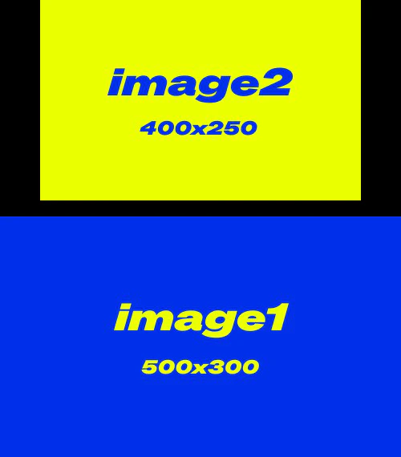
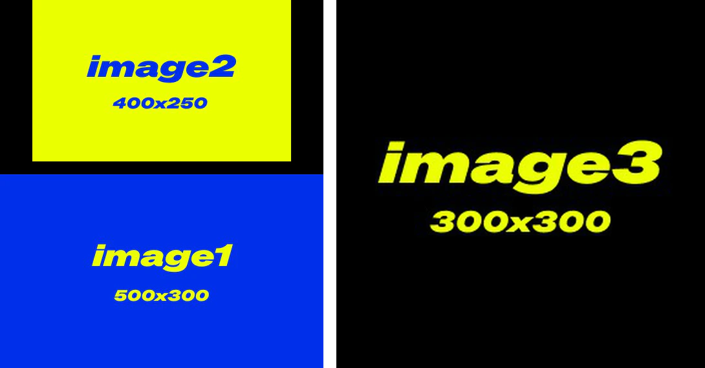

# Görüntü Birleştirme

Bu düğüm, iki görüntüyü belirtilen bir yönde (yukarı, aşağı, sol, sağ) birleştirmenize olanak tanır; boyut eşleştirme ve görüntüler arası boşluk desteği sunar.

## Girişler

| Parametre Adı | Açıklama | Veri Türü | Giriş Türü | Varsayılan | Aralık |
| --- | --- | --- | --- | --- | --- |
| `image1` | Birleştirilecek ilk görüntü | IMAGE | Zorunlu | - | - |
| `image2` | Birleştirilecek ikinci görüntü; sağlanmazsa yalnızca ilk görüntü döndürülür | IMAGE | İsteğe Bağlı | Yok | - |
| `yön` | İkinci görüntünün birleştirileceği yön: sağ, aşağı, sol veya yukarı | STRING | Zorunlu | sağ | sağ/aşağı/sol/yukarı |
| `görüntü boyutunu eşle` | İkinci görüntünün boyutlarının ilk görüntüyle eşleşecek şekilde yeniden boyutlandırılıp boyutlandırılmayacağı | BOOLEAN | Zorunlu | Doğru | Doğru/Yanlış |
| `boşluk genişliği` | Görüntüler arasındaki boşluğun genişliği; çift sayı olmalıdır | INT | Zorunlu | 0 | 0-1024 |
| `boşluk rengi` | Birleştirilen görüntüler arasındaki boşluğun rengi | STRING | Zorunlu | beyaz | beyaz/siyah/kırmızı/yeşil/mavi |

> `spacing_color` için, "beyaz/siyah" dışındaki renkler kullanıldığında, `match_image_size` `yanlış` olarak ayarlanırsa, dolgu alanı siyahla doldurulur

## Çıktılar

| Çıktı Adı | Açıklama | Veri Türü |
| --- | --- | --- |
| `IMAGE` | Birleştirilmiş görüntü | IMAGE |

## İş Akışı Örneği

Aşağıdaki iş akışında, örnek olarak farklı boyutlarda 3 adet giriş görüntüsü kullanılmıştır:

- image1: 500x300
- image2: 400x250
- image3: 300x300

**Birinci Görüntü Birleştirme Düğümü**

- `match_image_size`: yanlış, görüntüler orijinal boyutlarında birleştirilecektir
- `direction`: yukarı, `image2` `image1`'in üzerine yerleştirilecektir
- `spacing_width`: 20
- `spacing_color`: siyah

Çıktı görüntüsü 1:

**İkinci Görüntü Birleştirme Düğümü**

- `match_image_size`: doğru, ikinci görüntü ilk görüntünün yüksekliği veya genişliğiyle eşleşecek şekilde ölçeklenecektir
- `direction`: sağ, `image3` sağ tarafta görünecektir
- `spacing_width`: 20
- `spacing_color`: beyaz

Çıktı görüntüsü 2:

> Bu belge yapay zeka tarafından oluşturulmuştur. Herhangi bir hata bulursanız veya iyileştirme önerileriniz varsa, katkıda bulunmaktan çekinmeyin! [GitHub'da Düzenle](https://github.com/Comfy-Org/embedded-docs/blob/main/comfyui_embedded_docs/docs/ImageStitch/tr.md)
