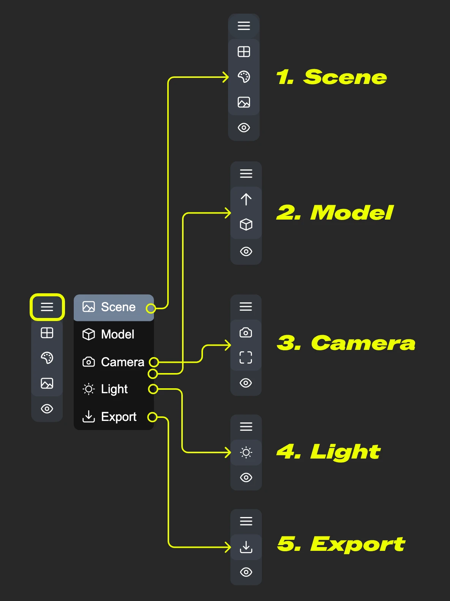
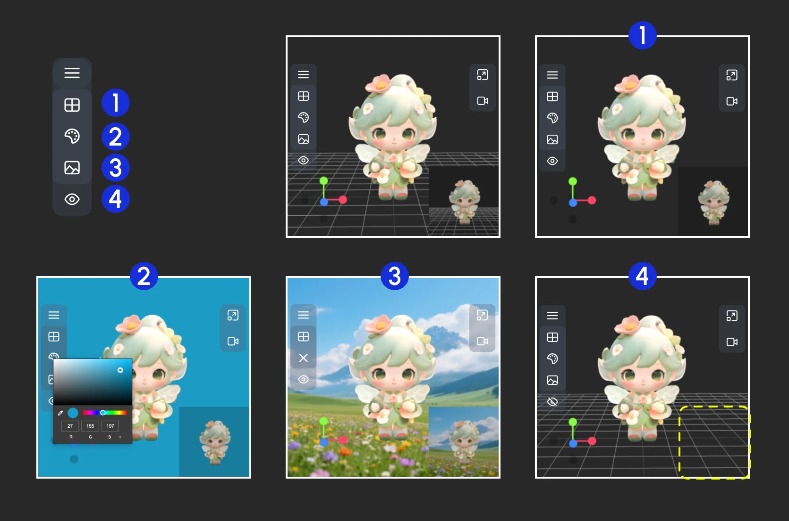
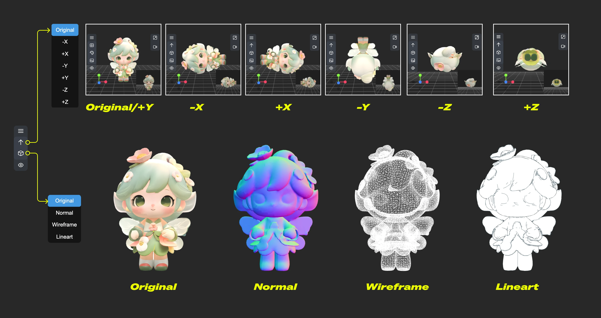
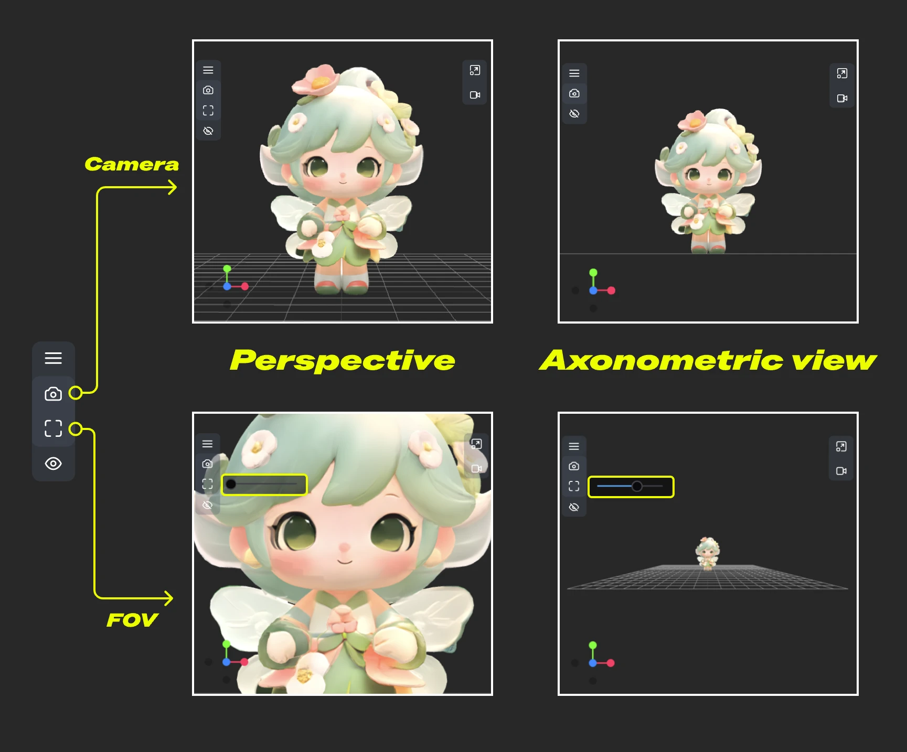
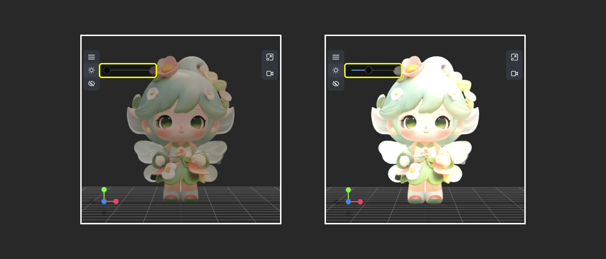
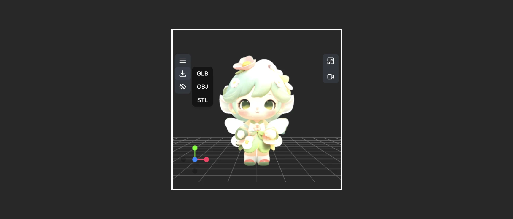

# Charger 3D

Voici la traduction en français de la documentation du nœud Load3D :

Le nœud Load3D est un nœud central pour le chargement et le traitement de fichiers de modèles 3D. Lors du chargement du nœud, il récupère automatiquement les ressources 3D disponibles depuis `ComfyUI/input/3d/`. Vous pouvez également télécharger des fichiers 3D pris en charge pour les prévisualiser à l'aide de la fonction de téléchargement.

**Formats pris en charge**
Actuellement, ce nœud prend en charge plusieurs formats de fichiers 3D, notamment `.gltf`, `.glb`, `.obj`, `.fbx` et `.stl`.

**Préférences des nœuds 3D**
Certaines préférences liées aux nœuds 3D peuvent être configurées dans le menu des paramètres de ComfyUI. Veuillez vous référer à la documentation suivante pour les paramètres correspondants :

[Menu des paramètres](https://docs.comfy.org/interface/settings/3d)

En plus des sorties de nœud standard, Load3D possède de nombreux paramètres liés à la vue 3D dans le menu du canevas.

## Entrées

| Nom du paramètre | Description | Type | Défaut | Plage |
| --- | --- | --- | --- | --- |
| model_file | Chemin du fichier du modèle 3D, prend en charge le téléchargement, lit par défaut les fichiers modèles depuis `ComfyUI/input/3d/` | Sélection de fichier | - | Formats pris en charge |
| width | Largeur de rendu du canevas | INT | 1024 | 1-4096 |
| height | Hauteur de rendu du canevas | INT | 1024 | 1-4096 |

## Sorties

| Nom du paramètre | Description | Type de données |
| --- | --- | --- |
| image | Image rendue du canevas | IMAGE |
| mask | Masque contenant la position actuelle du modèle | MASK |
| mesh_path | Chemin du fichier du modèle | STRING |
| normal | Carte normale | IMAGE |
| lineart | Sortie d'image de contour, le `edge_threshold` correspondant peut être ajusté dans le menu du modèle du canevas | IMAGE |
| camera_info | Informations de la caméra | LOAD3D_CAMERA |
| recording_video | Vidéo enregistrée (uniquement si un enregistrement existe) | VIDEO |

Aperçu de toutes les sorties :

## Description de la zone du canevas

La zone du canevas du nœud Load3D contient de nombreuses opérations de visualisation, notamment :

- Paramètres de la vue de prévisualisation (grille, couleur d'arrière-plan, vue de prévisualisation)
- Contrôle de la caméra : Contrôle du champ de vision (FOV), type de caméra
- Intensité de l'éclairage global : Ajuster l'intensité lumineuse
- Enregistrement vidéo : Enregistrer et exporter des vidéos
- Exportation du modèle : Prend en charge les formats `GLB`, `OBJ`, `STL`
- Et plus encore

1. Contient plusieurs menus et menus cachés du nœud Load 3D
2. Menu pour `redimensionner la fenêtre de prévisualisation` et `enregistrement vidéo du canevas`
3. Axe d'opération de la vue 3D
4. Vignette de prévisualisation
5. Paramètres de taille de prévisualisation, mise à l'échelle de l'affichage de la vue de prévisualisation en définissant les dimensions puis en redimensionnant la fenêtre

### 1. Opérations de visualisation

<video controls width="640" height="360">
  <source src="https://raw.githubusercontent.com/Comfy-Org/embedded-docs/refs/heads/main/comfyui_embedded_docs/docs/Load3D/asset/view_operations.mp4" type="video/mp4">
  Votre navigateur ne prend pas en charge la lecture vidéo.
</video>

Opérations de contrôle de la vue :

- Clic gauche + glisser : Faire pivoter la vue
- Clic droit + glisser : Panoramiquer la vue
- Molette du milieu ou clic milieu + glisser : Zoom avant/arrière
- Axe de coordonnées : Changer de vue

### 2. Fonctions du menu de gauche

Dans le canevas, certains paramètres sont cachés dans le menu. Cliquez sur le bouton du menu pour développer différents menus

- 1. Scène : Contient la grille de la fenêtre de prévisualisation, la couleur d'arrière-plan, les paramètres de prévisualisation
- 2. Modèle : Mode de rendu du modèle, textures des matériaux, paramètres de direction vers le haut
- 3. Caméra : Basculer entre les vues orthographique et perspective, et définir la taille de l'angle de perspective
- 4. Lumière : Intensité de l'éclairage global de la scène
- 5. Exporter : Exporter le modèle vers d'autres formats (GLB, OBJ, STL)

#### Scène

Le menu Scène fournit quelques fonctions de paramétrage de base de la scène

1. Afficher/Masquer la grille
2. Définir la couleur d'arrière-plan
3. Cliquer pour télécharger une image d'arrière-plan
4. Masquer la prévisualisation

#### Modèle

Le menu Modèle fournit quelques fonctions liées au modèle

1. **Direction vers le haut** : Déterminer quel axe est la direction vers le haut pour le modèle
2. **Mode matériau** : Changer les modes de rendu du modèle - Original, Normal, Filaire, Contour

#### Caméra

Ce menu permet de basculer entre les vues orthographique et perspective, et de définir la taille de l'angle de perspective

1. **Caméra** : Basculer rapidement entre les vues orthographique et orthographique
2. **FOV** : Ajuster l'angle du champ de vision

#### Lumière

Grâce à ce menu, vous pouvez rapidement ajuster l'intensité de l'éclairage global de la scène

#### Exporter

Ce menu offre la possibilité de convertir et d'exporter rapidement les formats de modèle

### 3. Fonctions du menu de droite

<video controls width="640" height="360">
  <source src="https://raw.githubusercontent.com/Comfy-Org/embedded-docs/refs/heads/main/comfyui_embedded_docs/docs/Load3D/asset/view_operations.mp4" type="video/mp4">
  Votre navigateur ne prend pas en charge la lecture vidéo.
</video>

Le menu de droite a deux fonctions principales :

1. **Réinitialiser le rapport de vue** : Après avoir cliqué sur le bouton, la vue ajustera le rapport de la zone de rendu du canevas en fonction de la largeur et de la hauteur définies
2. **Enregistrement vidéo** : Permet d'enregistrer les opérations actuelles de la vue 3D sous forme de vidéo, permet l'importation, et peut être sorti en tant que `recording_video` vers les nœuds suivants

> Cette documentation a été générée par IA. Si vous trouvez des erreurs ou avez des suggestions d'amélioration, n'hésitez pas à contribuer ! [Modifier sur GitHub](https://github.com/Comfy-Org/embedded-docs/blob/main/comfyui_embedded_docs/docs/Load3D/fr.md)
