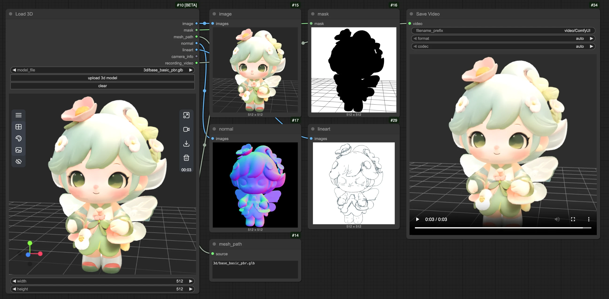
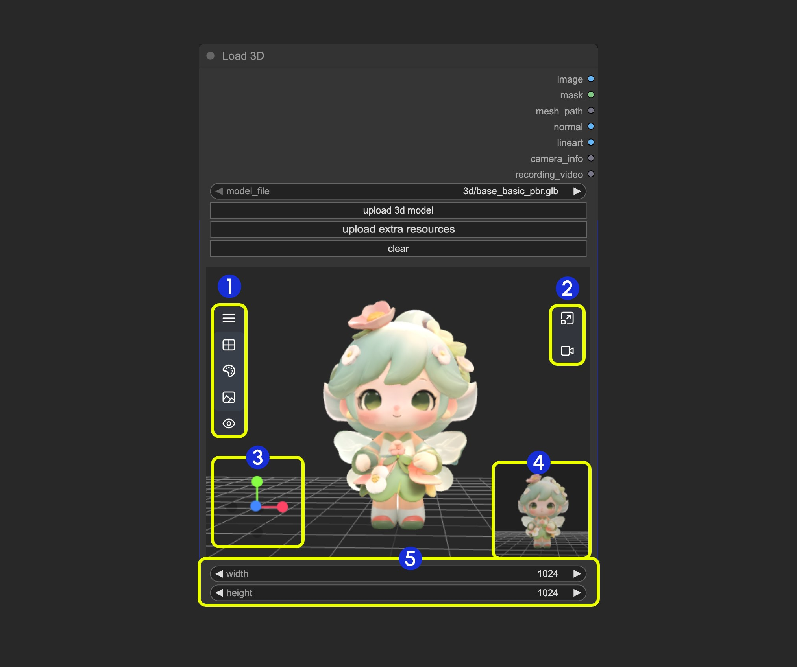

# Load3DAnimation

Eres un experto en traducción técnica especializado en documentación de nodos ComfyUI del inglés al español.

## Reglas de Traducción

1. **Contenido que NO debe traducirse:**
   - Nombres de parámetros entre comillas invertidas: `image`, `seed`, `model`
   - Tipos de datos en MAYÚSCULAS: IMAGE, STRING, INT, FLOAT, MODEL, CONDITIONING, etc.
   - Valores en columna Range: números, "auto", nombres de opciones
   - Código, rutas de archivos

2. **Contenido que SÍ debe traducirse:**
   - Títulos de secciones: ## Descripción general, ## Entradas, ## Salidas
   - Todo el texto descriptivo y explicativo
   - Descripciones de parámetros

3. **Calidad de traducción:**
   - Usar español estándar y neutral
   - Mantener tono profesional pero accesible
   - Asegurar precisión técnica
   - Usar terminología técnica estándar en español

4. **Formato:**
   - Mantener todo el formato Markdown
   - Preservar estructura de tablas
   - No agregar ninguna nota o enlace al inicio del documento (será agregado automáticamente)

Por favor traduce la siguiente documentación al español, sin incluir la nota inicial del documento:

El nodo Load3DAnimation es un nodo central para cargar y procesar archivos de modelos 3D. Al cargar el nodo, recupera automáticamente los recursos 3D disponibles de `ComfyUI/input/3d/`. También puedes cargar archivos 3D compatibles para previsualizarlos usando la función de carga.

> - La mayoría de las funciones de este nodo son las mismas que las del nodo Load 3D, pero este nodo admite la carga de modelos con animaciones, y puedes previsualizar las animaciones correspondientes en el nodo.
> - El contenido de esta documentación es el mismo que el del nodo Load3D, porque excepto por la previsualización y reproducción de animaciones, sus capacidades son idénticas.

**Formatos compatibles**
Actualmente, este nodo admite múltiples formatos de archivo 3D, incluyendo `.gltf`, `.glb`, `.obj`, `.fbx` y `.stl`.

**Preferencias del nodo 3D**
Algunas preferencias relacionadas con los nodos 3D se pueden configurar en el menú de ajustes de ComfyUI. Consulta la siguiente documentación para las configuraciones correspondientes:

[Menú de Ajustes](https://docs.comfy.org/interface/settings/3d)

Además de las salidas regulares del nodo, Load3D tiene muchas configuraciones relacionadas con la vista 3D en el menú del lienzo.

## Entradas

| Nombre del parámetro | Descripción | Tipo | Valor por defecto | Rango |
| --- | --- | --- | --- | --- |
| model_file | Ruta del archivo de modelo 3D, admite carga, por defecto lee archivos de modelo de `ComfyUI/input/3d/` | Selección de archivo | - | Formatos compatibles |
| width | Ancho de renderizado del lienzo | INT | 1024 | 1-4096 |
| height | Alto de renderizado del lienzo | INT | 1024 | 1-4096 |

## Salidas

| Nombre del parámetro | Descripción | Tipo de dato |
| --- | --- | --- |
| image | Imagen renderizada del lienzo | IMAGE |
| mask | Máscara que contiene la posición actual del modelo | MASK |
| mesh_path | Ruta del archivo del modelo | STRING |
| normal | Mapa de normales | IMAGE |
| lineart | Salida de imagen de arte lineal, el `edge_threshold` correspondiente se puede ajustar en el menú del modelo del lienzo | IMAGE |
| camera_info | Información de la cámara | LOAD3D_CAMERA |
| recording_video | Video grabado (solo cuando existe una grabación) | VIDEO |

Vista previa de todas las salidas:

## Descripción del Área del Lienzo

El área del Lienzo del nodo Load3D contiene numerosas operaciones de vista, incluyendo:

- Configuración de la vista previa (cuadrícula, color de fondo, vista previa)
- Control de cámara: Controlar FOV, tipo de cámara
- Intensidad de iluminación global: Ajustar la intensidad de la luz
- Grabación de video: Grabar y exportar videos
- Exportación de modelo: Admite formatos `GLB`, `OBJ`, `STL`
- Y más

1. Contiene múltiples menús y menús ocultos del nodo Load 3D
2. Menú para `redimensionar la ventana de vista previa` y `grabación de video del lienzo`
3. Eje de operación de la vista 3D
4. Miniatura de vista previa
5. Configuración del tamaño de vista previa, escala la visualización de la vista previa estableciendo dimensiones y luego redimensionando la ventana

### 1. Operaciones de Vista

<video controls width="640" height="360">
  <source src="https://raw.githubusercontent.com/Comfy-Org/embedded-docs/refs/heads/main/comfyui_embedded_docs/docs/Load3D/asset/view_operations.mp4" type="video/mp4">
  Tu navegador no admite la reproducción de video.
</video>

Operaciones de control de vista:

- Clic izquierdo + arrastrar: Rotar la vista
- Clic derecho + arrastrar: Desplazar la vista
- Desplazamiento de la rueda central o clic central + arrastrar: Acercar/Alejar
- Eje de coordenadas: Cambiar vistas

### 2. Funciones del Menú Izquierdo

En el lienzo, algunas configuraciones están ocultas en el menú. Haz clic en el botón del menú para expandir diferentes menús

- 1. Escena: Contiene cuadrícula de la ventana de vista previa, color de fondo, configuraciones de vista previa
- 2. Modelo: Modo de renderizado del modelo, materiales de textura, configuración de dirección hacia arriba
- 3. Cámara: Cambiar entre vistas ortográfica y perspectiva, y establecer el tamaño del ángulo de perspectiva
- 4. Luz: Intensidad de iluminación global de la escena
- 5. Exportar: Exportar modelo a otros formatos (GLB, OBJ, STL)

#### Escena

El menú Escena proporciona algunas funciones básicas de configuración de la escena

1. Mostrar/Ocultar cuadrícula
2. Establecer color de fondo
3. Haz clic para cargar una imagen de fondo
4. Ocultar la vista previa

#### Modelo

El menú Modelo proporciona algunas funciones relacionadas con el modelo

1. **Dirección hacia arriba**: Determinar qué eje es la dirección hacia arriba para el modelo
2. **Modo de material**: Cambiar los modos de renderizado del modelo - Original, Normal, Alámbrico, Arte lineal

#### Cámara

Este menú proporciona el cambio entre vistas ortográfica y perspectiva, y la configuración del tamaño del ángulo de perspectiva

1. **Cámara**: Cambiar rápidamente entre vista ortográfica y perspectiva
2. **FOV**: Ajustar el ángulo FOV

#### Luz

A través de este menú, puedes ajustar rápidamente la intensidad de iluminación global de la escena

#### Exportar

Este menú proporciona la capacidad de convertir y exportar rápidamente formatos de modelo

### 3. Funciones del Menú Derecho

<video controls width="640" height="360">
  <source src="https://raw.githubusercontent.com/Comfy-Org/embedded-docs/refs/heads/main/comfyui_embedded_docs/docs/Load3D/asset/recording.mp4" type="video/mp4">
  Tu navegador no admite la reproducción de video.
</video>

El menú derecho tiene dos funciones principales:

1. **Restablecer relación de aspecto de la vista**: Después de hacer clic en el botón, la vista ajustará la relación del área de renderizado del lienzo según el ancho y alto establecidos
2. **Grabación de video**: Te permite grabar las operaciones actuales de la vista 3D como video, permite la importación, y se puede emitir como `recording_video` a nodos posteriores

> Esta documentación fue generada por IA. Si encuentra algún error o tiene sugerencias de mejora, ¡no dude en contribuir! [Editar en GitHub](https://github.com/Comfy-Org/embedded-docs/blob/main/comfyui_embedded_docs/docs/Load3DAnimation/es.md)
