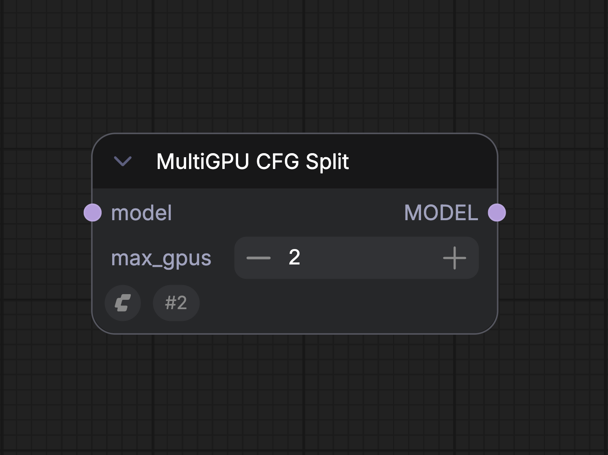

# División CFG MultiGPU

## Resumen general

El nodo MultiGPU CFG Split permite que el trabajo de difusión se reparta entre varias GPU instaladas en la misma computadora. La mejora de velocidad depende del flujo de trabajo, pero en flujos comunes se han medido aumentos de hasta 1.95x.

## Detalles importantes

No se admite mezclar tipos de GPU diferentes. Las GPU instaladas deben ser iguales, por ejemplo 2x 5090 o 2x 5080.

ComfyUI detecta automáticamente varias GPU instaladas cuando se inicia.

## GPUs compatibles

Cualquier configuración homogénea de dos GPU con arquitectura Ampere o superior, por ejemplo 2 x 3090 o 2 x RTX6000 Pro.

## Modelos compatibles

* LTX-2.3  
* WAN 2.2  
* FLUX.2 Klein - versiones base  
* Z-Image  
* Stable Diffusion 3.5 Large  
* Hunyuan Video  
* Qwen-Image-Edit-2511  
* Hunyuan-3D-v2.1  
* SDXL

## Entradas

| Parámetro | Descripción | Tipo de Dato | Obligatorio | Rango |
| --- | --- | --- | --- | --- |
| `model` | El modelo que se preparará para usar MultiGPU CFG Split antes del muestreo. | MODEL | Sí | N/A |
| `max_gpus` | La cantidad máxima de GPU idénticas que se usarán para repartir la carga. Ajústelo al número de GPU iguales instaladas en su sistema. | INT | Sí | Mínimo: 1 Paso: 1 Predeterminado: 2 |

## Salidas

| Nombre de salida | Descripción | Tipo de Dato |
| --- | --- | --- |
| `MODEL` | El modelo preparado para MultiGPU CFG Split, listo para un muestreo acelerado. | MODEL |

## Ubicación del nodo y notas del flujo de trabajo

El campo `max_gpus` debe configurarse con la cantidad máxima de GPU idénticas instaladas en el sistema.

**Ubicación del nodo:** MultiGPU CFG Split debe colocarse entre el nodo de carga del modelo y el nodo de muestreo. Si hay otros nodos conectados a la salida del modelo del cargador, MultiGPU CFG Split debe ser el último nodo de esa cadena antes del nodo de muestreo.

**Requisitos del flujo de trabajo:** Este nodo divide el flujo de difusión a nivel de CFG. Por eso, el CFG del flujo debe ser mayor que 1. Los flujos destilados que necesitan CFG = 1 no mostrarán una mejora de rendimiento al usar MultiGPU CFG Split con varias GPU.

## Verificación del uso de varias GPU

Cuando ejecute un flujo con MultiGPU CFG Split activado, puede abrir el Administrador de tareas de Windows y entrar en la categoría de rendimiento.

  

Mientras el sampler esté funcionando en el flujo, debería ver actividad en las dos GPU instaladas.

## Flujo de trabajo de ejemplo con varias GPU: (Wan 2.2 FP8)

[Flujo de trabajo de ejemplo (Wan 2.2 FP8)](https://raw.githubusercontent.com/Comfy-Org/embedded-docs/refs/heads/main/comfyui_embedded_docs/docs/MultiGPU_WorkUnits/asset/video_wan2_2_14B_t2v_mGPU.json)

> Esta documentación fue generada por IA. Si encuentra algún error o tiene sugerencias de mejora, ¡no dude en contribuir! [Editar en GitHub](https://github.com/Comfy-Org/embedded-docs/blob/main/comfyui_embedded_docs/docs/MultiGPU_WorkUnits/es.md)

---
**Source fingerprint (SHA-256):** `7293ee785e29aea9a1a70a10444b99e89fb23c866505628ec57c209a2b8aaee0`
