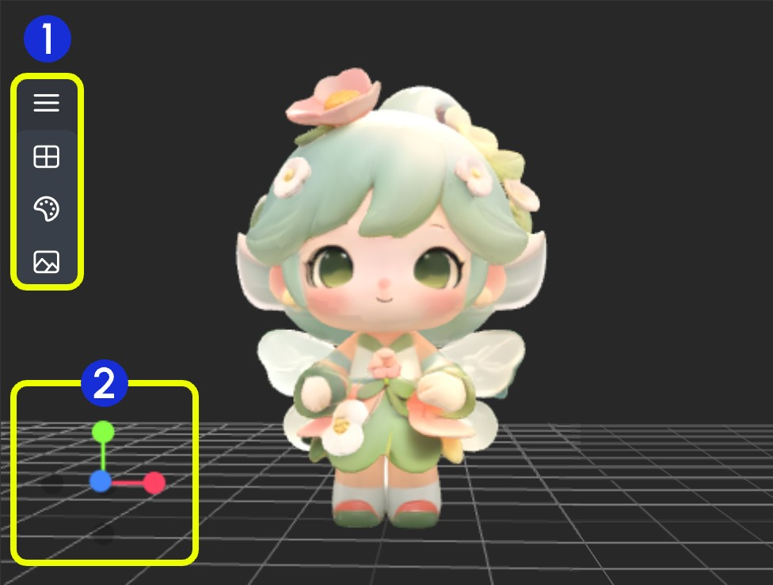

# Preview3DAnimation

O nó Preview3DAnimation é usado principalmente para visualizar saídas de modelos 3D. Este nó recebe duas entradas: uma é o `camera_info` do nó Load3D, e a outra é o caminho para o arquivo do modelo 3D. O caminho do arquivo do modelo deve estar localizado na pasta `ComfyUI/output`.

**Formatos Suportados**
Atualmente, este nó suporta vários formatos de arquivo 3D, incluindo `.gltf`, `.glb`, `.obj`, `.fbx` e `.stl`.

**Preferências do Nó 3D**
Algumas preferências relacionadas aos nós 3D podem ser configuradas no menu de configurações do ComfyUI. Consulte a seguinte documentação para as configurações correspondentes:
[Menu de Configurações](https://docs.comfy.org/interface/settings/3d)

## Entradas

| Nome do Parâmetro | Descrição | Tipo |
| --- | --- | --- |
| camera_info | Informações da câmera | LOAD3D_CAMERA |
| model_file | Caminho do arquivo do modelo em `ComfyUI/output/` | STRING |

## Descrição da Área do Canvas

Atualmente, os nós relacionados a 3D no frontend do ComfyUI compartilham o mesmo componente de canvas, portanto, suas operações básicas são em sua maioria consistentes, exceto por algumas diferenças funcionais.

> O conteúdo e a interface a seguir são baseados principalmente no nó Load3D. Consulte a interface real do nó para recursos específicos.

A área do Canvas inclui várias operações de visualização, como:

- Configurações da visualização de pré-visualização (grade, cor de fundo, visualização)
- Controle de câmera: FOV, tipo de câmera
- Intensidade da iluminação global: ajustar a iluminação
- Exportação de modelo: suporta formatos `GLB`, `OBJ`, `STL`
- etc.

1. Contém vários menus e menus ocultos do nó Load 3D
2. Eixo de operação da visualização 3D

### 1. Operações de Visualização

<video controls width="640" height="360">
  <source src="https://raw.githubusercontent.com/Comfy-Org/embedded-docs/refs/heads/main/comfyui_embedded_docs/docs/Load3D/asset/view_operations.mp4" type="video/mp4">
  Seu navegador não suporta a reprodução de vídeo.
</video>

Operações de controle de visualização:

- Clique esquerdo + arrastar: Girar a visualização
- Clique direito + arrastar: Mover a visualização
- Rolar o scroll do meio ou clique do meio + arrastar: Aumentar/diminuir zoom
- Eixo de coordenadas: Alternar visualizações

### 2. Funções do Menu Esquerdo

Na área de pré-visualização, alguns menus de operação de visualização estão ocultos no menu. Clique no botão do menu para expandir diferentes menus.

- 1. Cena: Contém configurações de grade da janela de pré-visualização, cor de fundo e miniatura
- 2. Modelo: Modo de renderização do modelo, material de textura, configurações de direção para cima
- 3. Câmera: Alternar entre visualizações ortográfica e perspectiva, definir ângulo de perspectiva
- 4. Luz: Intensidade da iluminação global da cena
- 5. Exportar: Exportar modelo para outros formatos (GLB, OBJ, STL)

#### Cena

O menu Cena fornece algumas funções básicas de configuração da cena:

1. Mostrar/Ocultar grade
2. Definir cor de fundo
3. Clique para enviar uma imagem de fundo
4. Ocultar miniatura de pré-visualização

#### Modelo

O menu Modelo fornece algumas funções relacionadas ao modelo:

1. **Direção para cima**: Determinar qual eixo é a direção para cima do modelo
2. **Modo de material**: Alternar modos de renderização do modelo - Original, Normal, Wireframe, Lineart

#### Câmera

Este menu fornece a alternância entre visualizações ortográfica e perspectiva, e configurações do tamanho do ângulo de perspectiva:

1. **Câmera**: Alternar rapidamente entre visualizações ortográfica e perspectiva
2. **FOV**: Ajustar o ângulo FOV

#### Luz

Através deste menu, você pode ajustar rapidamente a intensidade da iluminação global da cena

#### Exportar

Este menu fornece a capacidade de converter e exportar rapidamente formatos de modelo

> Esta documentação foi gerada por IA. Se você encontrar erros ou tiver sugestões de melhoria, sinta-se à vontade para contribuir! [Editar no GitHub](https://github.com/Comfy-Org/embedded-docs/blob/main/comfyui_embedded_docs/docs/Preview3DAnimation/pt-BR.md)
